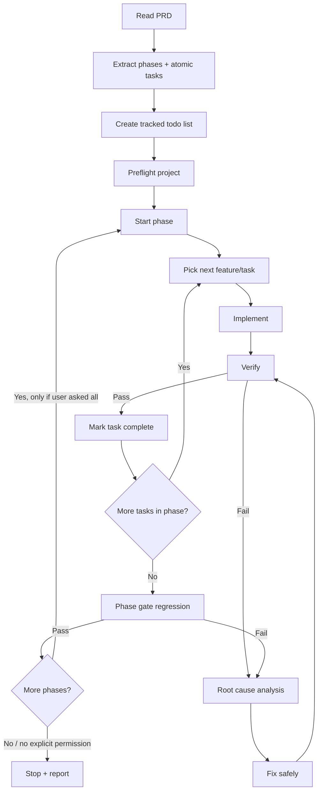

# Loop Engineering — PRD Phase Executor + Self-Correction

Skill ini membuat agent mengerjakan PRD **per phase** dengan loop aman, tetapi **manual-trigger only**. Skill tidak boleh berjalan otomatis.

```
BACA PRD → PECAH TASK → KERJAKAN 1 TASK KECIL → VERIFY → JIKA GAGAL RCA+FIX → VERIFY ULANG →
JIKA HIJAU STOP TASK/PHASE → LAPORKAN HASIL → TUNGGU INSTRUKSI USER UNTUK PHASE BERIKUTNYA
```

Tujuannya: agent tidak asal lanjut ketika kode masih salah dan tidak bergerak ke phase berikutnya tanpa izin user. Setiap task/feature harus melewati gate teknis sebelum dianggap selesai.

---

## Manual Loop Engineering Mode

Gunakan mode ini hanya jika user secara eksplisit meminta:

- "gunakan loop-engineering"
- "/loop-engineering"
- "kerjakan per phase dari PRD"
- "pakai mode manual-safe"

Mode ini **tidak aktif otomatis**.

### Default PRD Source

Jika user tidak menyebutkan file PRD lain, gunakan:

```text
docs/PRD.md
```

### Execution Rules

Saat mode loop-engineering aktif:

1. Baca PRD terlebih dahulu.
2. Kerjakan hanya phase yang diminta user.
3. Jika user tidak menyebut phase, kerjakan **phase 1 saja**.
4. Jangan lanjut ke phase berikutnya tanpa instruksi user.
5. Jangan edit file di luar scope phase yang sedang dikerjakan.
6. Implementasi harus dilakukan bertahap per task kecil.
7. Setelah implementasi, jalankan validasi berikut jika script tersedia:

```bash
npm run typecheck
npm run lint
npm run build
npm run test
```

8. Jika ada error:
   - lakukan root cause analysis,
   - jelaskan penyebab error,
   - perbaiki kode,
   - ulangi validasi sampai aman.

9. Jika semua validasi hijau, stop dan laporkan:
   - file yang diubah,
   - fitur yang selesai,
   - command validasi yang sudah dijalankan,
   - risiko atau sisa catatan.

### Safety Rule

Jangan menjalankan loop engineering secara otomatis.
Jangan lanjut ke phase berikutnya kecuali user meminta secara eksplisit.

## Kapan Dipakai

Gunakan skill ini saat user meminta:

- “kerjakan fitur dari PRD per phase”
- “loop engineering”
- “kalau kode salah ulangi, kalau benar stop dan lanjut phase berikutnya”
- “implement PRD sampai aman”
- “AI coding agent test fitur lalu fix bug sampai tidak ada error”
- “lanjutkan phase berikutnya kalau phase sekarang sudah benar”
- “gunakan loop-engineering”
- “/loop-engineering”
- “pakai mode manual-safe”

Bedanya dengan skill lain:

- `execute-prd` = parse PRD → task list → eksekusi bertahap.
- `test-fix-loop` = test app live → fix bug sampai hijau.
- `loop-engineering` = **gabungan keduanya** untuk workflow end-to-end PRD: build per phase + self-check + self-fix + phase gate.

---

## Mode Default

```
Mode kerja              : MANUAL-SAFE
Trigger                 : hanya jika user eksplisit meminta loop-engineering
Default PRD             : docs/PRD.md
Scope default           : phase 1 saja jika user tidak menyebut phase
Unit kerja              : 1 task kecil / 1 atomic task group per loop
Max retry per task       : 3
Max retry per phase      : 5
Stop sukses task         : typecheck/lint/build/test relevan hijau
Stop sukses phase        : semua task phase target hijau + regression phase hijau
Stop setelah phase       : YA, tunggu instruksi user
Lanjut phase otomatis    : TIDAK
Stop gagal/block         : requirement ambigu, akses/API key tidak ada, destructive action, no-progress
Commit otomatis          : TIDAK
```

Jika user menyebut `--safe`, jalankan semua gate yang tersedia: lint/typecheck/build/unit/e2e/browser smoke.

Jika user menyebut `all`, kerjakan semua phase hanya jika instruksi itu eksplisit. Tetap berhenti saat blocked, destructive action, atau butuh keputusan user.

---

## Prinsip Wajib

1. **Root cause dulu, baru fix.** Jangan patch gejala.
2. **Satu task aktif.** Jangan ubah banyak fitur sekaligus.
3. **Tidak lanjut phase kalau gate gagal.** Fix dulu sampai hijau atau stop sebagai blocked.
4. **Stop saat benar.** Kalau semua verifikasi feature/phase sudah hijau, jangan over-engineer.
5. **Jangan lanjut otomatis ke phase berikutnya.** Lanjut hanya jika user eksplisit meminta phase berikutnya atau meminta `all`.
6. **Jangan melemahkan kualitas demi test hijau.** Dilarang `any`, `// @ts-ignore`, mematikan guard, menghapus validasi, skip assertion, atau comment-out fitur.
7. **Jangan destructive tanpa konfirmasi.** Drop DB, reset migration, hapus data, rewrite history Git, atau overwrite besar harus minta izin.

---

## Input yang Diharapkan

```
/loop-engineering
/loop-engineering docs/PRD.md phase 1
/loop-engineering docs/PRD-myapp.md phase 2
/loop-engineering docs/PRD-myapp.md all --safe
```

Jika PRD belum jelas:

- Jalankan review cepat memakai pola `analyze-prd`.
- Kalau hanya minor gap, buat asumsi eksplisit dan lanjut.
- Kalau keputusan bisnis/arsitektur besar tidak jelas, stop dan tanya bigboss.

---

## Workflow Utama



---

## Step 1 — Parse PRD

Baca PRD dari path yang disebut user. Jika user tidak menyebut path, gunakan `docs/PRD.md`. Jika user tidak menyebut phase, targetkan `phase 1` saja.

Ekstrak:

```
Phase:
  - tujuan phase
  - dependency phase sebelumnya
  - daftar feature group
  - daftar atomic task
  - acceptance criteria
  - file/module yang kemungkinan terdampak
  - layer: [FE] [BE] [AI] [DB] [OPS] [TEST]
```

Normalisasi task:

- Jika task terlalu besar, pecah menjadi task atomik.
- Jika task tidak punya acceptance criteria, buat gate teknis minimal.
- Jika ada dependency antar task, urutkan dependency lebih dulu.

Contoh todo:

```
[ ] Phase 1 — Foundation
    [ ] [OPS] Setup env + package scripts
    [ ] [DB]  Setup Prisma schema + validate
    [ ] [BE]  Setup NestJS module base
    [ ] [FE]  Setup layout shell

[ ] Phase 2 — Auth
    [ ] [BE] Register/login DTO + service
    [ ] [BE] JWT cookie + guard
    [ ] [FE] Login/register form
    [ ] [TEST] Auth smoke test
```

---

## Step 2 — Preflight Safety

Sebelum coding, cek kondisi project:

```bash
git status --short
pwd
ls
```

Lalu deteksi command yang tersedia:

```bash
cat package.json
find . -maxdepth 3 -name package.json -o -name pyproject.toml -o -name requirements.txt -o -name docker-compose.yml
```

Wajib catat:

- package manager: npm/pnpm/yarn
- struktur project: `frontend/`, `backend/`, `ai-service/`, `docker/`
- script validasi: `typecheck`, `lint`, `build`, `test`, `test:e2e`
- status Git sebelum perubahan

Jika Git tidak bersih, tetap boleh lanjut **hanya jika user memang meminta lanjut**, tapi laporkan bahwa revert lebih sulit. Jangan commit otomatis.

---

## Step 3 — Implement Loop per Task

Untuk setiap task:

```
1. Set todo task → in_progress
2. Baca file terkait sebelum edit
3. Implement minimal sesuai PRD
4. Jalankan verification gate sesuai layer
5. Kalau pass → mark completed
6. Kalau fail → RCA → fix → ulangi maksimal 3 retry
7. Kalau tetap fail → STOP blocked dengan laporan jelas
```

Aturan implementasi:

- Kode TypeScript harus strict dan tanpa `any`.
- File besar > 200 baris dipecah.
- Backend NestJS: DTO → Service → Controller → Guard.
- Frontend Next.js: service API → TanStack Query hook → component.
- Prisma v7: `prisma.config.ts`, no `url` di datasource, gunakan generated client sesuai standar pack.
- Jangan mengubah scope di luar task kecuali dependency langsung.

---

## Step 4 — Verification Gate

Pilih gate berdasarkan layer task.

### Universal Gate

Jalankan jika tersedia:

```bash
npm run typecheck
npm run lint
npm run build
npm run test
```

Jika script tidak ada, gunakan fallback:

```bash
npx tsc --noEmit
```

### Frontend Gate `[FE]`

```bash
npm run typecheck
npm run build
```

Tambahan jika UI/flow berubah:

```bash
npm run test:e2e
```

Atau pakai Playwright live Chrome dari skill `test-live` untuk smoke test flow utama.

### Backend Gate `[BE]`

```bash
npm run typecheck
npm run test
npm run build
```

Tambahan API smoke test bila server tersedia:

```bash
curl -i http://localhost:<port>/health
```

### Database/Prisma Gate `[DB]`

```bash
npx prisma validate
npx prisma generate
```

Migration/reset/drop database termasuk destructive atau semi-destructive. Minta konfirmasi kalau dapat menghapus data.

### AI Service Gate `[AI]`

Node.js:

```bash
npm run typecheck
npm run test
```

Python:

```bash
python3 -m compileall .
python3 -c "import sys; print(sys.version)"
```

### Docker/OPS Gate `[OPS]`

```bash
docker compose config
```

---

## Step 5 — Root Cause Analysis Saat Gagal

Saat verifikasi gagal, format internalnya:

```
Failure:
  - command yang gagal
  - pesan error utama
  - file/lokasi error

Root cause:
  - penyebab paling mungkin
  - kenapa fix sebelumnya gagal jika retry > 1

Fix plan:
  - perubahan spesifik
  - file yang akan diedit
  - risiko
```

Klasifikasi:

### AUTO-FIX

Boleh langsung fix jika akar masalah jelas dan risiko rendah:

- typo import/path
- type mismatch lokal
- missing export/import
- DTO kurang field yang jelas dari PRD
- query invalidation lupa
- component prop mismatch
- Prisma select/include kurang field non-sensitif
- env example kurang key
- test gagal karena selector/fixture jelas salah

### CONFIRM

Stop dan minta konfirmasi jika:

- perlu migration baru yang mengubah data penting
- perlu ubah auth/security/permission model
- perlu ganti dependency besar
- perlu menghapus/rename banyak file
- ada lebih dari satu desain solusi yang sama-sama valid

### BLOCK

Stop jika:

- API key/kredensial tidak ada
- requirement PRD bertentangan
- bug berasal dari service eksternal/downstream
- error tidak berkurang setelah retry maksimal
- verification tidak bisa dijalankan karena environment tidak tersedia

---

## Step 6 — Phase Gate

Setelah semua task dalam phase selesai, jalankan phase gate:

```
□ Semua task phase completed
□ Semua acceptance criteria phase terpenuhi
□ Typecheck hijau
□ Build hijau jika tersedia
□ Test/unit/e2e relevan hijau jika tersedia
□ Tidak ada regression dari phase sebelumnya
□ Tidak ada TODO blocker / temporary workaround
```

Jika phase gate gagal:

- Jangan lanjut phase berikutnya.
- Lakukan RCA + fix loop maksimal 5 retry per phase.
- Kalau masih gagal, stop dengan laporan blocked.

Jika phase gate pass:

- Tulis checkpoint ringkas.
- **Stop setelah phase target selesai.**
- Jangan lanjut phase berikutnya kecuali user meminta eksplisit, misalnya `phase 2`, `lanjut phase berikutnya`, atau `all`.

---

## Step 7 — Final Stop Condition

Skill berhenti sukses hanya jika:

```
□ Semua phase target completed
□ Semua phase gate pass
□ Final regression pass
□ Typecheck pass
□ Build pass jika tersedia
□ Test relevan pass jika tersedia
□ Tidak ada blocker tersisa
```

Final report wajib:

```
## ✅ Loop Engineering Selesai

PRD: docs/PRD-myapp.md
Scope: target phase / explicit all
Phase selesai: sesuai target
Task selesai: sesuai target
Retry total: 6

Verifikasi:
- typecheck: pass
- build: pass
- test: pass
- e2e/browser smoke: pass/skipped + alasan

Perubahan utama:
- Phase target: ...

Catatan:
- Tidak ada blocker.
- Disarankan review diff lalu commit manual.
```

Jika stop blocked:

```
## ⚠️ Loop Engineering Berhenti

Phase: 2 — Auth
Task: JWT refresh rotation
Status: blocked

Yang sudah selesai:
- ...

Root cause blocker:
- ...

Butuh keputusan bigboss:
1. Opsi A ...
2. Opsi B ...

Kode terakhir:
- aman / perlu revert file X
```

---

## Resume Workflow

Jika sesi terputus:

1. Baca todo/progress sebelumnya jika ada.
2. Cek `git diff` untuk mengetahui perubahan terakhir.
3. Jalankan verification gate terlebih dulu.
4. Lanjut dari task pending pertama.
5. Jangan mengulang task yang sudah terbukti pass kecuali regression gagal.

---

## Larangan Keras

- JANGAN menjalankan loop-engineering tanpa trigger eksplisit user.
- JANGAN lanjut ke phase berikutnya tanpa instruksi eksplisit user.
- JANGAN lanjut ke phase berikutnya kalau phase gate gagal.
- JANGAN klaim selesai tanpa command verifikasi nyata.
- JANGAN memperbaiki test dengan menghapus assertion penting.
- JANGAN mematikan auth/guard/validation agar flow lolos.
- JANGAN memakai `any`, `ts-ignore`, atau type loosening sebagai fix cepat.
- JANGAN melakukan destructive DB/Git action tanpa konfirmasi.
- JANGAN refactor besar di tengah bugfix loop kecuali memang root cause-nya architecture-level dan user setuju.
- JANGAN commit otomatis.

## Task

$ARGUMENTS
