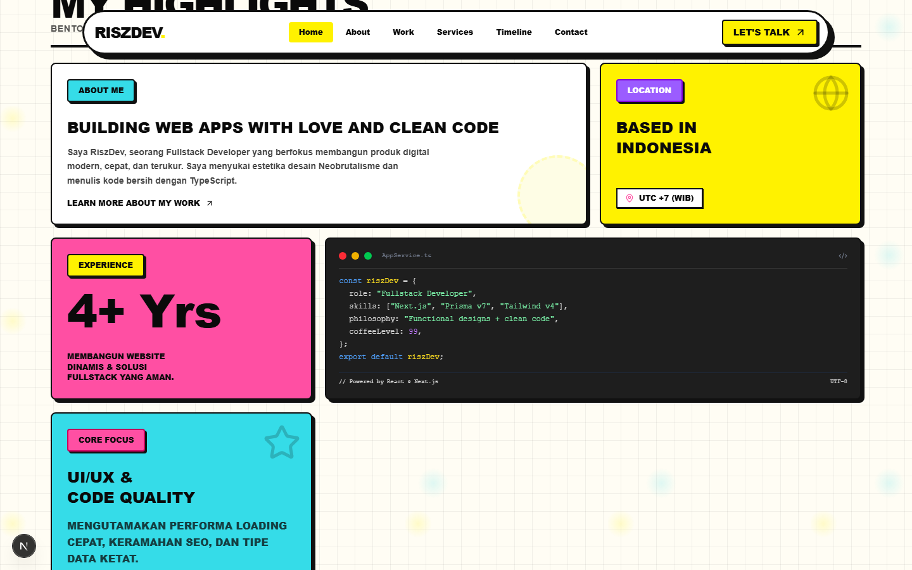
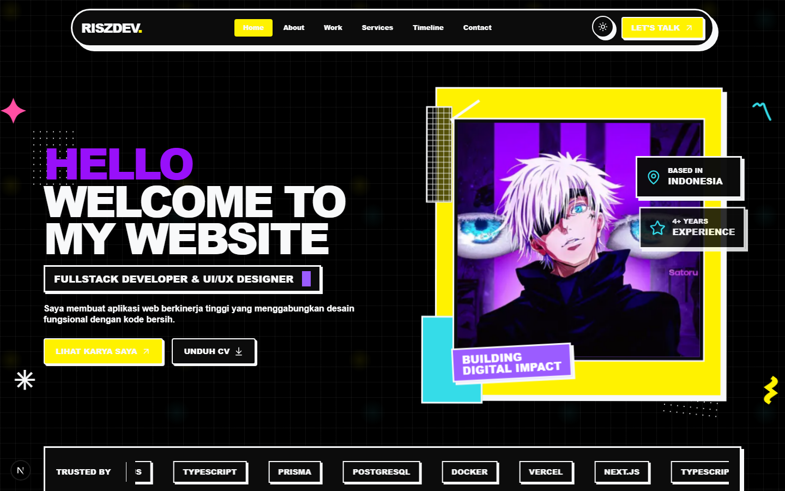
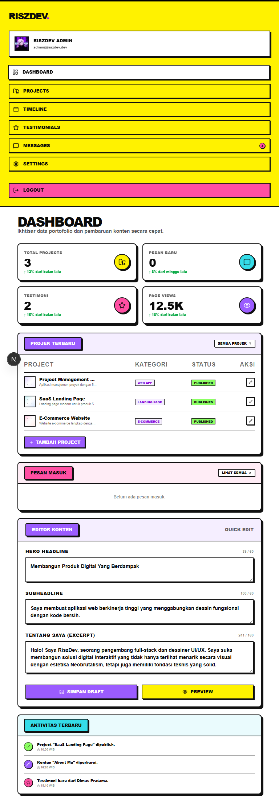

# RiszDev Portfolio - Cyber-Neobrutalism UI 🚀

Website portofolio interaktif dan sistem manajemen konten (CMS) admin bertema **Cyber-Neobrutalism UI** yang premium, modern, dan berkinerja tinggi. Dibangun menggunakan teknologi web terkini seperti **Next.js 16 (App Router)**, **Tailwind CSS v4**, **Prisma v7**, **PostgreSQL 16**, dan animasi **GSAP**.

---

## 📸 Tampilan Visual

### 1. Bento Grid Highlights
Bento grid asimetris responsif yang menampilkan sekilas data profil, keahlian utama, zona waktu, dan terminal editor kode mock.


### 2. Mode Gelap Hitam Pekat (Pitch Black)
Estetika visual neobrutalisme gelap berlatar belakang hitam pekat kontras tinggi dengan garis batas putih neon yang tajam.


### 3. Dasbor Admin Responsif
CMS admin terproteksi dengan visual grafik statistik, kelola pesan, kelola portofolio, dan konfigurasi umum situs.


---

## ✨ Fitur Utama

- 🎨 **Estetika Cyber-Neobrutalism:** Desain modern dengan warna kontras tebal, garis batas tegas, dan bayangan *hard-shadow*.
- 🌓 **Mode Gelap (Pitch Black):** Transisi tema terang ke hitam pekat instan tanpa flashing sesi awal (menggunakan inline pre-render script).
- 🧩 **Bento Grid Highlights:** Tata letak grid dinamis dengan animasi elastis GSAP ScrollTrigger.
- 🔐 **Autentikasi Mandiri Aman:** Pengelolaan sesi login admin menggunakan custom session cookie yang dienkripsi aman dengan algoritma **AES-256-GCM**.
- 📊 **CMS Admin Lengkap (CRUD):**
  - CRUD Projects (Kelola portofolio & slug otomatis).
  - CRUD Timeline (Kelola riwayat karir & pendidikan).
  - CRUD Testimonials (Persetujuan & penyembunyian testimoni klien).
  - CRUD Site Settings (Konfigurasi SEO, sosial media JSON, email kontak, dan WhatsApp).
  - Contact Message Reader (Pembaca & penghapus pesan masuk dari pengunjung).
- 🚀 **Performa Tinggi:** Integrasi Incremental Static Regeneration (ISR) Next.js dengan pembaruan dinamis berkala 60 detik.
- 🛡️ **Keamanan:** Proteksi rate-limiting pada API kontak publik (maks. 3 req/menit) dan login admin (maks. 5 req/menit) untuk mencegah serangan brute force.

---

## 🛠️ Tech Stack

- **Frontend:** Next.js 16 (App Router), React 19, Tailwind CSS v4, Lucide Icons, GSAP, `@gsap/react`.
- **Database & ORM:** PostgreSQL 16, Prisma v7 (`@prisma/client` dengan driver adapter `pg`).
- **Validasi:** Zod (validasi skema data client & server).
- **Alur Kerja Git:** Husky, Commitlint (Conventional Commits), ESlint, TypeScript compiler.
- **Infrastruktur:** Docker, Docker Compose (multi-stage Next.js production build).

---

## 📦 Panduan Instalasi & Penggunaan

### 1. Prasyarat
Pastikan Anda sudah menginstal aplikasi berikut di sistem Anda:
- **Node.js** >= v20.19.0
- **npm** >= v10.0.0
- **Docker** dan **Docker Compose** (jika menggunakan database/deployment kontainer)

### 2. Kloning & Persiapan Berkas Environment
Salin repositori ke komputer lokal Anda:
```bash
git clone <repository-url>
cd "Porto NeoBrustalism v2"
```

Buat salinan berkas `.env` dari file contoh yang disediakan:
```bash
cp frontend/.env.example frontend/.env
```
Isi variabel konfigurasi di dalam `frontend/.env` sesuai konfigurasi sistem database Anda.

### 3. Menjalankan Database PostgreSQL (Docker)
Jalankan kontainer database PostgreSQL melalui docker-compose di root folder:
```bash
docker compose up -d db
```

### 4. Setup Database & Migrasi Prisma
Masuk ke direktori `frontend/`, lalu jalankan sinkronisasi skema database dan masukkan data awal (seeding):
```bash
cd frontend
npm install
npx prisma db push
npx tsx prisma/seed.ts
```

*Data Akun Admin Default setelah Seed:*
- **Email:** `admin@riszdev.dev`
- **Password:** `password123`

### 5. Jalankan Aplikasi di Lingkungan Pengembangan
Jalankan server Next.js lokal:
```bash
npm run dev
```
Buka [http://localhost:3000](http://localhost:3000) di browser Anda untuk melihat portofolio, dan [http://localhost:3000/login](http://localhost:3000/login) untuk masuk ke panel admin CMS.

---

## 🐳 Docker Deployment (Produksi)

Untuk memaketkan seluruh sistem aplikasi ke lingkungan produksi secara otomatis (Next.js multi-stage build + PostgreSQL 16):

1. Jalankan perintah kompilasi docker compose di root folder:
   ```bash
   docker compose build
   ```
2. Jalankan seluruh layanan kontainer secara background:
   ```bash
   docker compose up -d
   ```

---

## 🤝 Standarisasi Kode (Git Hooks)

Proyek ini menggunakan **Husky** dan **Commitlint** untuk menjaga kualitas kode dan kerapian repositori:
* **Pre-commit Hook:** Memeriksa tipe data TypeScript (`npm run typecheck`) dan mendeteksi kesalahan sintaks kode (`npm run lint`) sebelum commit diizinkan.
* **Commit Message Hook:** Mewajibkan pesan commit mematuhi standard *Conventional Commits*, contoh:
  * `feat(ui): add new dark mode toggle`
  * `fix(api): resolve contact form rate limit database connection leak`
  * `chore(deps): update prisma v7 packages`
